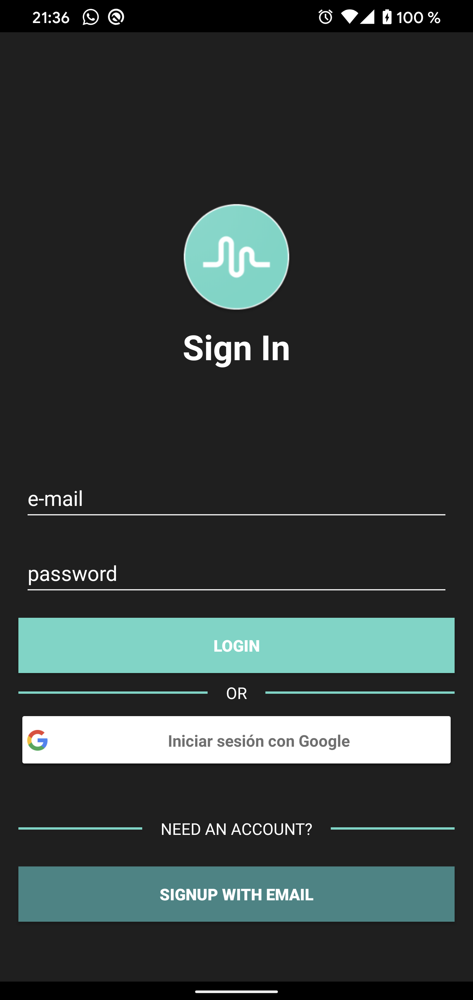
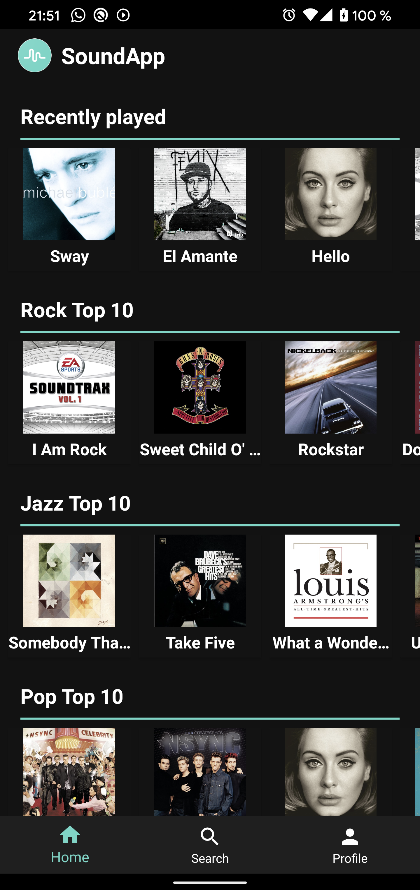
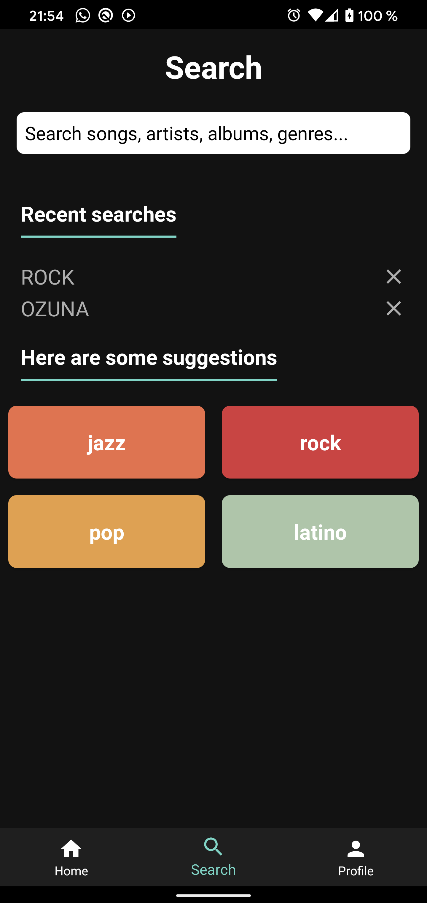
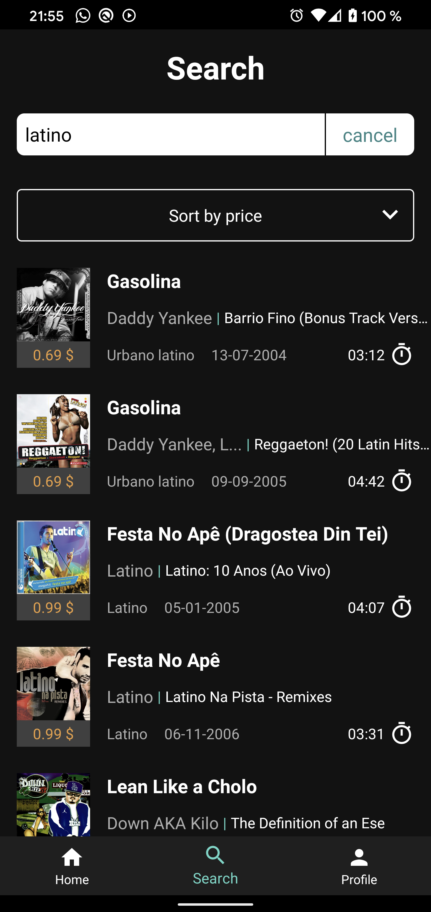
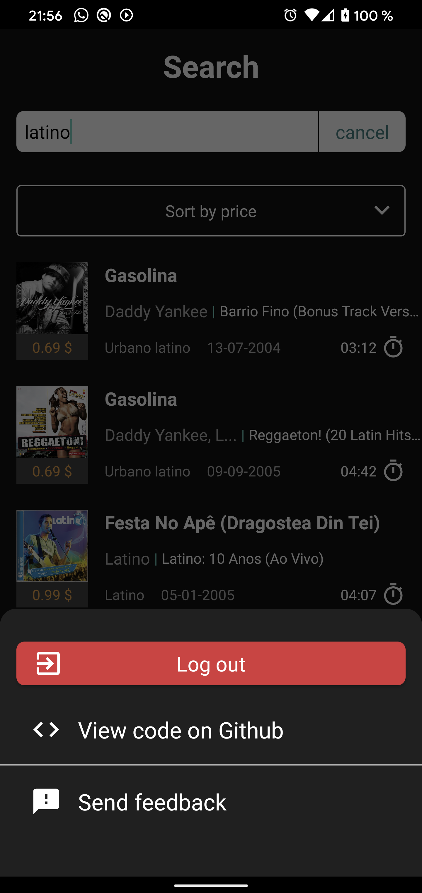

# SoundApp

# Goals
The aim of this project is to develop an music player application. 

# Requirements
On the first screen we would see a search bar where you can enter the terms (whether artists, songs, albums, genres ...) The search results should be listed on the same screen, showing the song title and artist, and more in detail, the album title, release date, cover thumbnail, song length, genre and price. It should offer the ability to sort the list over these last three fields. Then, each result should navigate to a second screen in which, with a similar design to current music players, allows us to visualise the cover detail, basic information about the song and the basic controls to listen the song, play and pause, and skip to the previous and next song in the list of search results.

# Solution

## Modular Application with Clean Architecture
The application has been developed focusing on feature-modules. On each of this modules, a VIPER approximation has been used as an internal architecture. 

An example of how it has been modularized is shown in the following figure.

Then, each feature module follows a Clean Architecture as shown in the figure below.

The advantages of this approach is that the dependencies between each functionality are reduced, and each feature
is independent of any other feature, which makes each piece of code more testable and independent of the external
ones. For example, if the intention is to reuse the list module in another project that is using Koin for the dependency
injection, if this approach is used it would be possible to just move the feature-module to this other project by only
changing the implementation of the router.

A possible disadvantage that can occur with this implementation is that it can not be ensured that the domain layer
has no dependencies with the other layer as it is in the Clean Architecture approach. A possible solution to that issue
is to implement a lint rule in order to avoid including imports from other packages.

To sum up, we can see in table 4 the advantages and inconveniences of each approach:

## Technological stack

* Kotlin
* Dagger 2
* Retrofit
* Realm
* Firebase
* Espresso
* MockWebServer
* JUnit4

## Application

Here the application screens are presented

